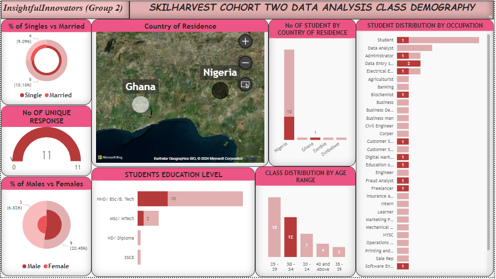

# SkilHarvest-Cohort2-DA-Class-Demography-Documentation

**Documentation Outline**
- [Project Overview](#project-overview)
- [Data Sources](#data-sources)
- [Tools Used](#tools-used)
- [Data Cleaning and Preparation](#data-cleaning-and-preparation)
- [Data Analysis](#data-analysis)
- [Results and Findings](#results-and-findings)
- [Conclusion and Recommendations](#conclusion-and-recommendations)

## Project Overview
This Data Analysis project aims to get insight from the SkilHarvest Cohort 2 Students data 
collated during one of our class session. By analyzing the various parameters in the data set received,
I seek to understand certain informations about the students, such as their age, marital status, education level etc.

## Data Sources
The primary source of the data used is from google form that was generated in the class for students to fill.

## Tools Used
- Google Form [Download Here](https://bit.ly/SkilHarvestClassData)
- Google Sheet [Download Here](https://docs.google.com/spreadsheets/d/1j683Iej1rexP0ZklCt4CQSEjTZpUGAfhIirowQNtk80/edit?resourcekey#gid=120058417)
- Power BI
- Power Query Editor

## Data Cleaning and Preparation
The data set was transformed by changing 
- the data type of the "Phone Number" from any to text

## Data Analysis

## Results and Findings

some of the insight drived from the data set are as follows:
- A Total of 44 persons responded spread around 4 African Countries
- There are a Total 33 distinct "Occupations" and 4 distinct "Educational Levels"
- The data shows that about 48% are Females and 52% are Males
- The data also shows that majority of the responses recieved are Singles
- The Age Range are in 5 categories and majority of the responses received are between ages 25 - 29

## Conclusion and Recommendations
The data set was transformed using power query editor and loaded into Power BI canva for visualization

